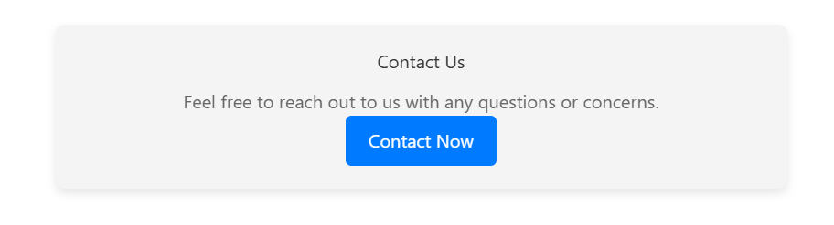
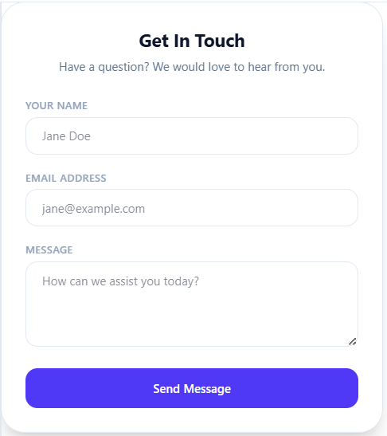
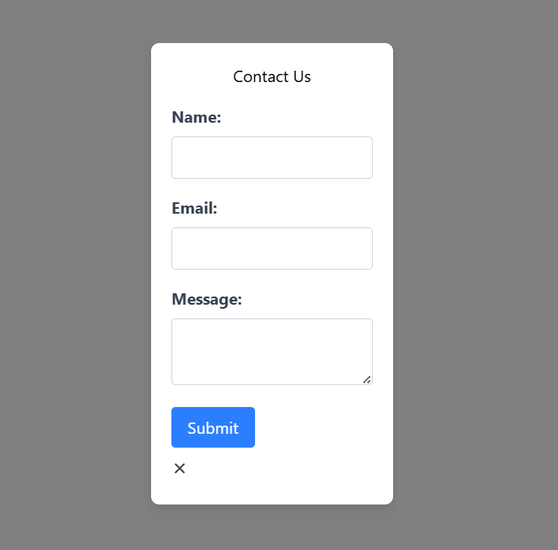
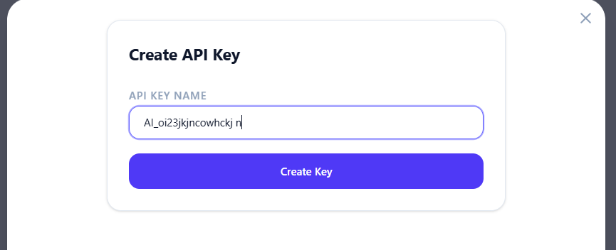
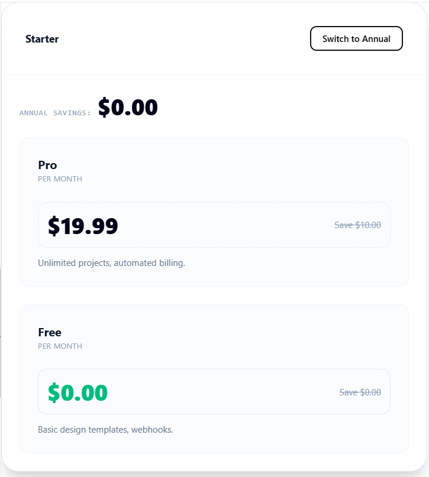
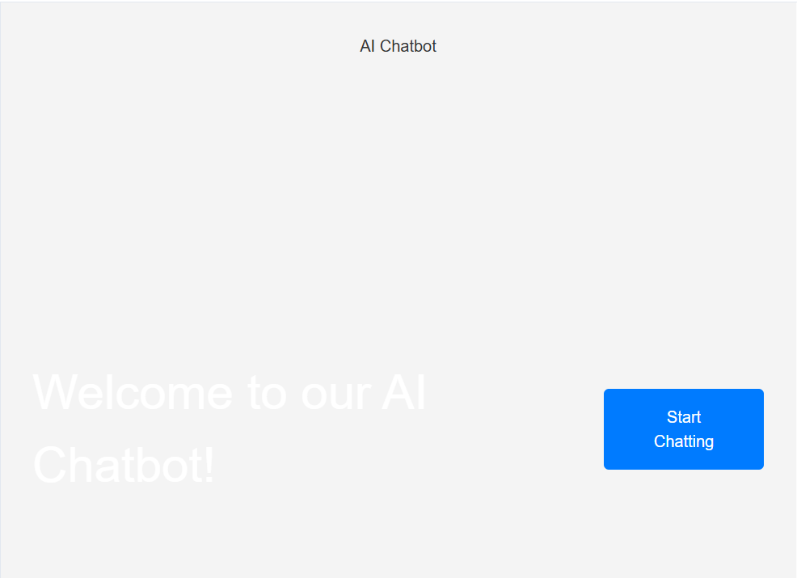
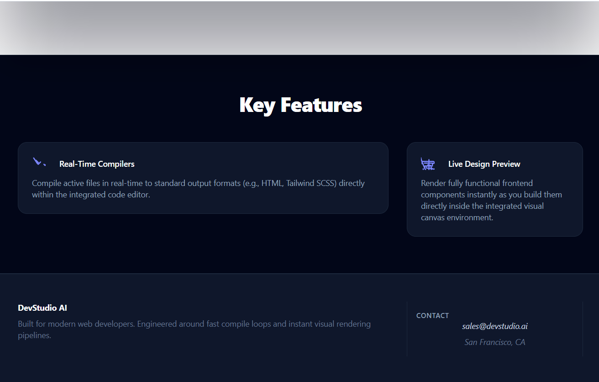
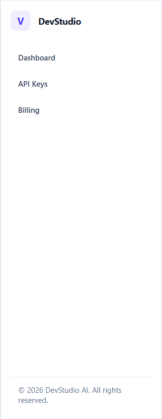

# DevStudio-1.5B vs. Qwen-Coder-1.5B Base Model
## Fine-Tuning Performance & Comparison Report

This report evaluates the visual quality, code standards, and layout complexity of the fine-tuned **DevStudio-1.5B** against its pre-trained parent model, **Qwen-Coder-1.5B (Base)**, across five design prompts.

---

## Technical Overview of Enhancements

Through target parameter-efficient fine-tuning (QLoRA) on a curated single-file Tailwind CSS and HTML dataset, several key behavioral shifts were achieved:

*   **Strict SFT Alignment:** The fine-tuned model completely eliminates conversational prefixes (e.g., *"Certainly! Here is your code..."*) and trailing explanations, immediately outputting clean code blocks.
*   **Modern Utility Class Compliance:** Bypasses the base model's tendency to write custom internal `<style>` rules. It relies entirely on utility-first Tailwind classes, aligning with Tailwind CSS v3 standards.
*   **Aesthetic & Color Palette Modernization:** Replaces outdated, generic colors with refined semantic combinations (such as `zinc`, `slate`, and `slate-950` with high-contrast accent systems like `indigo`, `violet`, and `emerald`).
*   **Interactive JavaScript Integration:** Seamlessly incorporates vanilla JavaScript to build fully functional interfaces (dynamic tab toggling, modal dismissal, sliders, and collapsible sidebar states).

---

## Side-by-Side Prompt Evaluations

Below is a detailed analysis of the five benchmark prompts with links to their rendered screenshot outputs.

### Prompt 1: "simple clean contact us card layout"

*   **Base Model [A]**: Employs outdated Tailwind v2 via a deprecated CDN link. Falls back to manual CSS styles inside a `<style>` block for basic properties (padding, border-radius, and text alignments), leaving the HTML bare. Does not generate interactive input fields.
*   **DevStudio-1.5B [B]**: Outputs fully semantic markup styled with modern Tailwind v3 utilities. Renders a complete interactive contact form with proper accessibility parameters, precise label spacing, and subtle focus states (`focus:ring-1 focus:ring-indigo-500/50`).

| Base Model (Qwen-Coder-1.5B) | Fine-Tuned (DevStudio-1.5B) |
| :---: | :---: |
|  |  |

---

### Prompt 2: "modal overlay with clean input fields and buttons"

*   **Base Model [A]**: Often fails to understand the structural concept of a "backdrop overlay." Renders a standard static card in the middle of a blank canvas with rigid, hardcoded CSS margins.
*   **DevStudio-1.5B [B]**: Correctly implements standard overlay semantics with a translucent dark backdrop (`bg-slate-900/40` or equivalent) and a floating container dialog, featuring clean form inputs, proper spacing, and standard cancel/delete action triggers.

| Base Model (Qwen-Coder-1.5B) | Fine-Tuned (DevStudio-1.5B) |
| :---: | :---: |
|  |  |

---

### Prompt 3: "modern saas pricing page"

*   **Base Model [A]**: Builds a basic multi-column grid, but the card designs lack visual elevation, subtle gradient cues, or distinct structural separation between tiers.
*   **DevStudio-1.5B [B]**: Delivers an advanced SaaS layout. Uses subtle drop shadows (`shadow-xl`), highlighted active borders for popular tiers, modern badges (`text-[10px] uppercase font-bold`), and custom list indicator icons designed entirely with inline SVGs.

| Base Model (Qwen-Coder-1.5B) | Fine-Tuned (DevStudio-1.5B) |
| :---: | :---: |
|  |  |

---

### Prompt 4: "Landing page component for a ai chat website"

*   **Base Model [A]**: Renders text-heavy, static content blocks using basic styling. Lacks modern graphical elements, layouts, or conversational UI mockups.
*   **DevStudio-1.5B [B]**: Implements advanced landing page techniques, including dark-mode canvas backgrounds, glowing gradient overlays, structural call-to-action blocks, and realistic visual mockups of live chat windows with user and assistant message bubbles.

| Base Model (Qwen-Coder-1.5B) | Fine-Tuned (DevStudio-1.5B) |
| :---: | :---: |
|  |  |

---

### Prompt 5: "A common sidebar componnet"

*   **Base Model [A]**: Generates a rudimentary left-aligned navigation list. Lacks advanced modular dividers, icon wrappers, active state styling, or hover transitions.
*   **DevStudio-1.5B [B]**: Renders a complete admin panel sidebar featuring highlighted active tabs, customizable user profiles, notification counts, and an interactive collapsible submenu with smoothly rotating SVG indicators powered by vanilla JavaScript.

| Base Model (Qwen-Coder-1.5B) | Fine-Tuned (DevStudio-1.5B) |
| :---: | :---: |
|  |  |

---

## Conclusion & Core Findings

While the base model is highly capable of interpreting basic text layout instructions, it struggles to generate modern Web 2.0 aesthetics, often reverting to raw CSS and obsolete styling frameworks. 

By contrast, **DevStudio-1.5B** consistently aligns with current design trends, producing semantic, clean, production-ready, and responsive HTML interfaces with integrated interactivity directly from vague user queries.