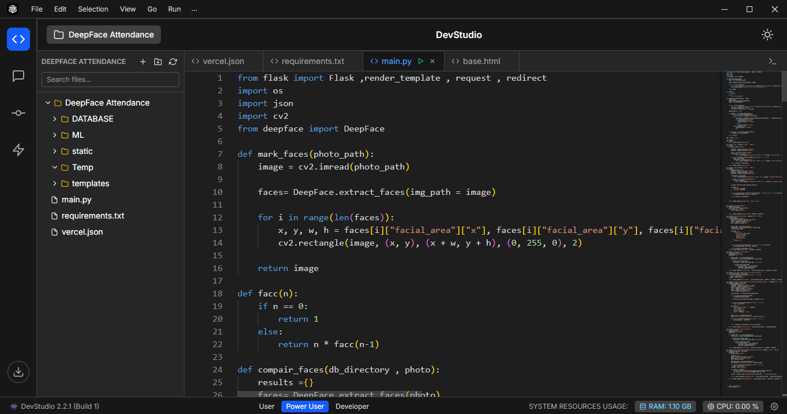
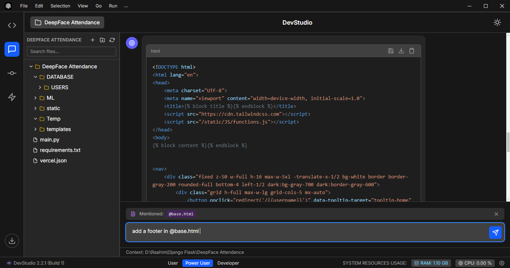
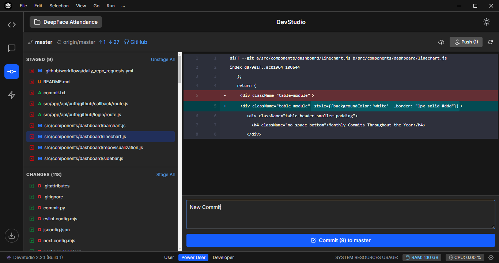
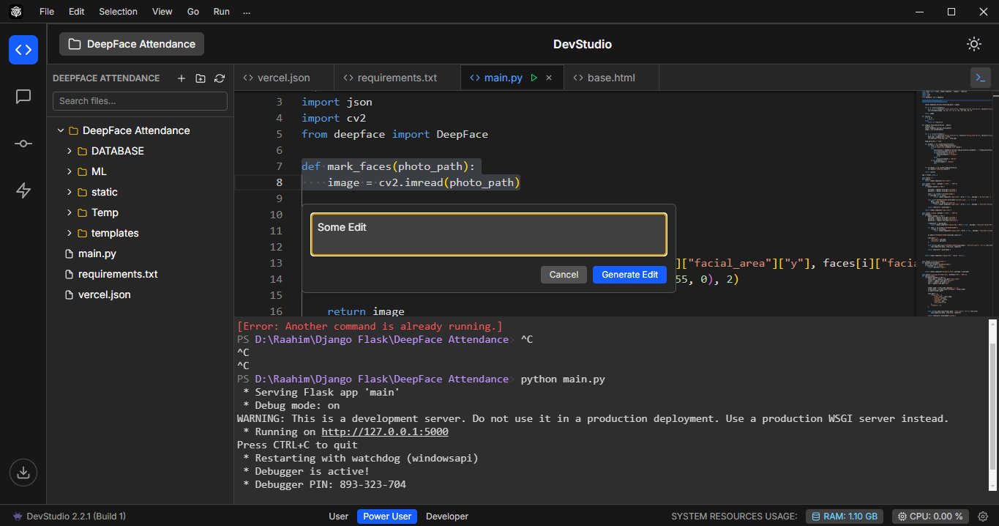

  <!-- You can create a simple logo and place it here -->
  

  <h1>DevStudio Code Editor</h1>

  

    <strong>Code at the Speed of Thought.</strong>
  

  

    An intelligent, AI-powered code editor built with Electron and Monaco to supercharge your development workflow.
  

  <!-- Badges -->
  

    
    
    
    
  

  

##  Tech Stack

## ✨ Features in Action
 
 
 

Check out the demo video to see DevStudio in action: [Watch Demo](https://res.cloudinary.com/dtykfxrql/video/upload/v1744085710/demo_q1fsxu.mp4)

---

Built on the same core editor that powers VS Code (Monaco Editor), DevStudio provides a familiar, blazing-fast editing experience, enhanced with a native layer of artificial intelligence.

## 🚀 Core Features

-   🧠 **Intelligent AI Assistance**:
    -   **Context-Aware Code Completion**: Get smart suggestions that understand the context of your project.
    -   **Code Generation**: Describe what you want to build in plain English and let the AI generate boilerplate code for you.
    -   **Debugging & Explanation**: Stuck on a bug or complex function? Ask DevStudio to explain the code or suggest a fix.

-   ⚛️ **Powered by Monaco Editor**:
    -   Enjoy the world-class editing experience you already love from VS Code, including lightning-fast performance, syntax highlighting for dozens of languages, and IntelliSense.

-   📦 **Built-in GitHub Integration**:
    -   Clone repositories, view diffs, stage changes, write commit messages, and push your work—all without ever leaving the editor.

-   🎨 **Sleek & Customizable UI**:
    -   A clean, minimalist interface built with Next.js and Tailwind CSS that gets out of your way.
    -   Customize themes, fonts, and layouts to create your perfect coding environment.

-   🌐 **Cross-Platform**:
    -   Built with Electron, DevStudio runs smoothly on Windows, macOS, and Linux.

## 🛠️ Tech Stack

DevStudio is built with a modern and powerful stack:

| Technology         | Description                                        |
| ------------------ | -------------------------------------------------- |
| ⚡ **Electron**   | For building the cross-platform desktop application. |
| ⚛️ **Next.js**     | For the UI and frontend logic.                     |
| ✏️ **Monaco Editor** | The core text editor engine from VS Code.          |
| 💨 **Tailwind CSS** | For utility-first styling and rapid UI development.|
| 🍃 **MongoDB**     | For storing user settings and project data.        |
| 🟢 **Node.js**     | For the backend logic and server-side operations.  |

## 📦 Installation

Get up and running with DevStudio in minutes.

1.  **Download the Latest Release**:
    - Head over to the [**Releases Page**](https://github.com/Raahim2/DevStudio/releases) and download the appropriate installer for your operating system (`.exe` for Windows, `.dmg` for macOS, `.AppImage` or `.deb` for Linux).

2.  **Install & Launch**:
    - Run the installer and launch DevStudio. You're ready to code!

## 🤝 Contributing

Contributions are what make the open-source community such an amazing place to learn, inspire, and create. Any contributions you make are **greatly appreciated**.

If you have a suggestion that would make this better, please fork the repo and create a pull request. You can also simply open an issue with the tag "enhancement".

1.  **Fork the Project**
2.  **Create your Feature Branch** (`git checkout -b feature/AmazingFeature`)
3.  **Commit your Changes** (`git commit -m 'Add some AmazingFeature'`)
4.  **Push to the Branch** (`git push origin feature/AmazingFeature`)
5.  **Open a Pull Request**

Don't forget to give the project a star! Thanks again!

## 📜 License

Distributed under the MIT License. See `LICENSE` for more information.

---

  
Built with ❤️ by the DevStudio Team

